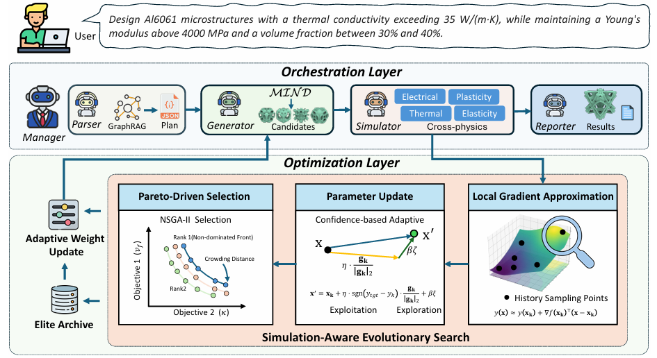

# AutoMS: Multi-Agent Evolutionary Search for Cross-Physics Inverse Microstructure Design

<p align="center">
  <strong>ICML 2026</strong>
</p>

<p align="center">
  Zhenyuan Zhao<sup>*</sup>, Yu Xing<sup>*</sup>, Tianyang Xue, Lingxin Cao, Xin Yan, and Lin Lu
</p>

<p align="center">
  <sup>*</sup> Equal contribution
</p>

Official code and instructions for the ICML 2026 paper:

> **AutoMS: Multi-Agent Evolutionary Search for Cross-Physics Inverse Microstructure Design**

## Teaser

<p align="center">
  
</p>

AutoMS converts a natural-language microstructure request into a closed-loop
design workflow. Specialized agents parse requirements, generate candidate
microstructures, run the requested physics simulations, and use
Simulation-Aware Evolutionary Search (SAES) to guide subsequent design rounds.


## Setup

Use Python 3.10 or newer. Conda is not required; create any isolated Python
environment appropriate for your machine, then install the base dependencies:

```powershell
python -m venv .venv
.\.venv\Scripts\Activate.ps1
python -m pip install --upgrade pip
python -m pip install -r requirements.txt
```

Copy the environment template and set credentials for an OpenAI-compatible
endpoint:

```powershell
Copy-Item .env.example .env
```

Set `OPENAI_API_KEY` in `.env`. `OPENAI_BASE_URL`, `AUTOMS_MAIN_MODEL`, and
`AUTOMS_EMBEDDING_MODEL` may be changed for a compatible provider. The
configuration loader reads `.env` beside the chosen config file and reports
missing `${ENV_VAR}` values before agents are initialized.

## Run the Agent Workflow

Pass a request explicitly:

```powershell
python main.py --query "Design a lightweight microstructure with a target elastic modulus."
```

Or send a request through standard input:

```powershell
"Design a lightweight microstructure." | python main.py
```

Use another safe config file when needed:

```powershell
python main.py --config config.local.yaml --query "Your request"
```


## Citation

If you use this work, please cite:

```bibtex
@inproceedings{zhao2026automs,
  title     = {AutoMS: Multi-Agent Evolutionary Search for Cross-Physics Inverse Microstructure Design},
  author    = {Zhao, Zhenyuan and Xing, Yu and Xue, Tianyang and Cao, Lingxin and Yan, Xin and Lu, Lin},
  booktitle = {Proceedings of the 43rd International Conference on Machine Learning},
  series    = {Proceedings of Machine Learning Research},
  volume    = {306},
  year      = {2026},
  address   = {Seoul, South Korea},
  publisher = {PMLR}
}
```


## License

This project is released under the [MIT License](LICENSE). Third-party tools,
models, datasets, and checkpoints retain their own licenses and distribution
terms.
